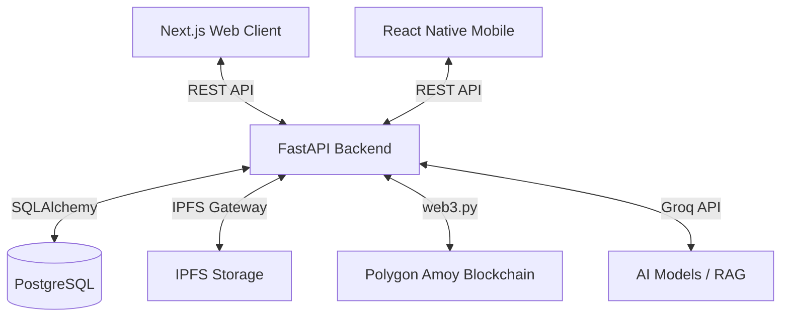

<div align="center">
  
  
  # MedSync
  **The Decentralized, AI-Powered Healthcare Ecosystem**

  [](https://opensource.org/licenses/MIT)
  [](https://nextjs.org/)
  [](https://fastapi.tiangolo.com/)
  [](https://expo.dev/)
  [](https://polygon.technology/)
</div>

<br />

## 📖 Project Overview

MedSync is a comprehensive, production-ready healthcare management monorepo designed as a final-year Computer Science engineering project. It solves the fragmentation of modern healthcare by bridging Patients, Doctors, and Pharmacies through a single unified platform.

### Problem Statement
Existing healthcare systems are highly siloed. Patients struggle to transport medical records between hospitals, pharmacies rely on easily forged paper prescriptions, and doctors lack intelligent tools for rapid diagnostic assistance.

### Proposed System (Key Features)
- **Immutable Medical Records**: File hashes are stored on the Polygon blockchain via IPFS, ensuring zero-knowledge privacy and preventing tampering.
- **AI Diagnostics**: Doctors have access to a Computer Vision pipeline (EfficientNet/YOLO) for scanning X-rays/MRIs, while patients can chat with a RAG-powered LLM (via Groq).
- **Secure E-Prescriptions**: Doctors push prescriptions directly to verified Pharmacies on-chain.
- **Cross-Platform Access**: A Next.js web portal and an Expo React Native mobile app.
- **Production DevOps**: Fully containerized with Docker, Nginx, and GitHub Actions CI/CD.

## 🏗️ High-Level Architecture



## 📂 Monorepo Structure

| Directory | Description |
|-----------|-------------|
| `apps/backend/` | FastAPI Python server (Auth, AI, Blockchain Relayer) |
| `apps/web/` | Next.js 15 Web Application (React, Tailwind, Shadcn) |
| `apps/mobile/` | Expo React Native Mobile App |
| `apps/blockchain/` | Solidity Smart Contracts & Hardhat deployment |
| `docs/` | Deep-dive architectural and API documentation |
| `infrastructure/` | Docker, Nginx, CI/CD, and deployment scripts |

## 🚀 Quick Start

Ensure you have **Docker** and **Node.js 18+** installed.

1. **Clone the repository**:
   ```bash
   git clone https://github.com/your-username/medsync.git
   cd medsync
   ```

2. **Environment Setup**:
   ```bash
   cp .env.example .env
   # Update the .env file with your specific API keys
   ```

3. **Run the Infrastructure**:
   ```bash
   ./infrastructure/scripts/start.sh
   ```
   * The Web App will be available at `http://localhost:3000`
   * The API Docs will be available at `http://localhost:8000/docs`

## 📚 Documentation Directory

Please explore the `docs/` folder for comprehensive manuals:
- [Architecture Guide](./docs/ARCHITECTURE.md)
- [API Reference](./docs/API.md)
- [Database Schema](./docs/DATABASE.md)
- [AI Pipelines](./docs/AI.md)

## 📄 License
This project is licensed under the MIT License - see the [LICENSE](LICENSE) file for details.
