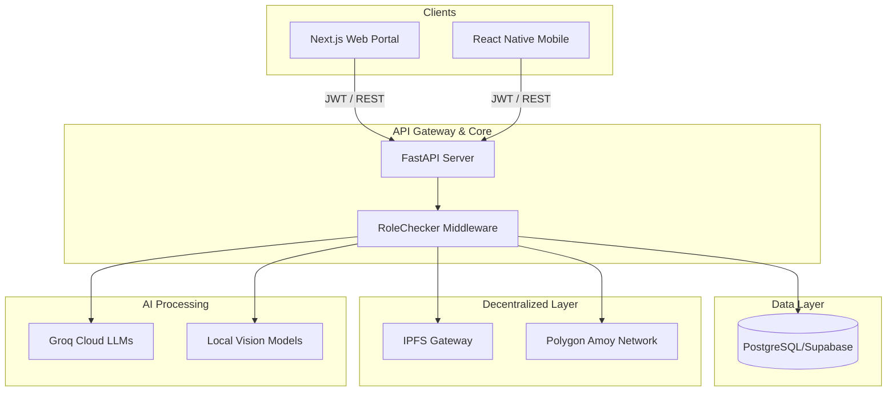

# System Architecture

The MedSync architecture is highly modular, decentralized, and horizontally scalable. It bridges traditional Web2 capabilities (Next.js, FastAPI, Postgres) with Web3 primitives (Polygon Amoy, IPFS) and bleeding-edge AI models (YOLO, EfficientNet, Groq).

## 1. Overall System Architecture

## 2. Blockchain & IPFS Flow (Medical Records)
To ensure maximum privacy (HIPAA/GDPR compliance):
1. A doctor uploads a patient's medical file.
2. The file is temporarily stored, hashed via SHA-256, and pushed to **IPFS**.
3. IPFS returns a Content Identifier (CID).
4. The backend securely signs a transaction with the CID, Hash, and Patient ID, pushing it to the **MedicalRecordRegistry.sol** on Polygon.
5. The raw file is backed up to Supabase Storage. The blockchain *only* holds the hash for verification.

## 3. Frontend Architecture (Next.js)
- **State Management**: `TanStack Query (v5)` manages server state, caching, and background polling.
- **Styling**: `Tailwind CSS` with `shadcn/ui` provides a strict, accessible design system.
- **Security**: The custom Axios instance forcibly purges tokens on `401 Unauthorized` responses and redirects to `/login`.

## 4. Mobile Architecture (Expo)
- **Navigation**: `Expo Router` determines tab stacks dynamically based on user role.
- **Token Security**: Tokens are encrypted via `expo-secure-store` using native Keystore/Keychain, never exposed to `AsyncStorage`.
