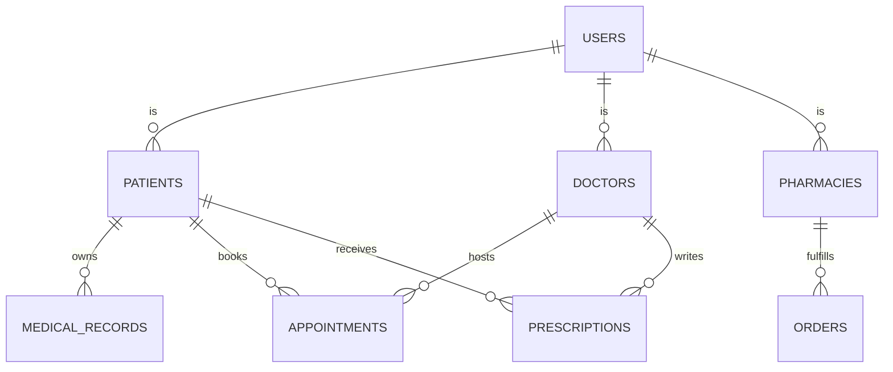

# Database Architecture (PostgreSQL)

MedSync relies on a highly normalized relational database mapped via SQLAlchemy 2.0.

## ER Overview

## Core Tables

### 1. `users`
The root table for all authentication.
- `id` (UUID, Primary Key)
- `email` (String, Unique, Indexed)
- `hashed_password` (String)
- `role` (Enum: `patient`, `doctor`, `pharmacy`, `admin`)
- `is_active` (Boolean)

### 2. `patients`, `doctors`, `pharmacies`
Role-specific profile tables linking back to `users.id` via Foreign Keys.
- `patients` includes `blood_type`, `emergency_contact`.
- `doctors` includes `license_number`, `specialty`, `verified_status`.
- `pharmacies` includes `license_number`, `address`.

### 3. `medical_records`
Stores the metadata and off-chain references.
- `ipfs_cid` (String, for decentralized retrieval)
- `file_hash` (String, for blockchain verification)
- `encryption_iv` (String, for future symmetric encryption)

### 4. `appointments` & `prescriptions`
Transactional tables tracking the lifecycle of doctor-patient interactions and resulting medical prescriptions.
